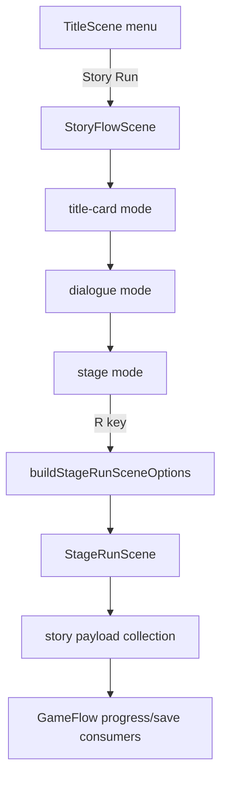

# Story Content System

Badger Sprawl Runner keeps the authored campaign, runtime scene flow, and procedural replay layer separated but connected through typed contracts. This document explains the content path so future chapter, dialogue, boss, companion, and procgen additions can land without turning `StageRunScene` into a story-data singleton.

## High-level flow

```yaml
content_pipeline:
  source_design:
    - docs/story-flavour.yml
    - docs/PROCEDURAL_GENERATION.md
    - todo.md stage checklists
  typed_campaign_registry:
    file: apps/runner/src/game/Campaign.ts
    exports:
      - CAMPAIGN
      - CAMPAIGN_SIDE_QUESTS
      - CAMPAIGN_MINIGAMES
      - CAMPAIGN_MINIGAMES
      - BRANCH_CONSEQUENCES
  story_flow_projection:
    file: apps/runner/src/game/GameFlow.ts
    responsibilities:
      - menu state
      - stage title cards
      - briefing/debrief routing
      - branch choice result flags
      - save-facing story progress
      - active branch consequence lookup
  stage_runtime_adapter:
    file: apps/runner/src/game/StageRunOptions.ts
    responsibilities:
      - map current GameFlow stage to StageRunSceneOptions
      - pass acquired payload ids
      - pass branch gameplay hooks
      - pass boss phase contracts
      - generate procedural enemy packs
      - generate optional side rooms
  runtime_scene:
    file: apps/runner/src/scenes/StageRunScene.ts
    responsibilities:
      - load stage-addressable layout
      - append generated side-room content
      - apply companion modifiers
      - apply boss phase pressure
      - run combat, items, camera, renderer, and UI
```

## Main content types

```yaml
CampaignStage:
  owns:
    - chapter identity
    - place and act
    - primary verb
    - dramatic question
    - placard
    - heist payload
    - briefing
    - debrief
    - boss contract
    - tutorial beats
    - choice outcomes
    - traversal hazards
  does_not_own:
    - transient player position
    - generated enemy pack seed state
    - renderer instances
    - save storage

BossContract:
  owns:
    - boss id
    - name
    - argument
    - phase count
    - phase mechanics
    - lessons/cues
  runtime_consumers:
    - GameFlow stage specs
    - StoryFlowScene boss phase preview
    - StageRunOptions bossPhases projection
    - BossPhaseSystem pressure logic

ChoiceOutcome:
  owns:
    - prompt
    - branch id
    - result flag
    - consequence text
    - optional meta delta
  runtime_consumers:
    - GameFlow.chooseStageChoice
    - BRANCH_CONSEQUENCES lookup
    - StageRunOptions branchGameplayHooks
    - CompanionSystem modifiers

BranchConsequence:
  owns:
    - resultFlag dependency
    - affected stage ids
    - gameplayHook contract
    - UI hint
  runtime_consumers:
    - GameFlow.getActiveBranchConsequences
    - StoryFlowScene branch effect preview
    - StageRunOptions branchGameplayHooks
    - CompanionSystem.resolveCompanionGameplayModifiers

StageMinigame:
  owns:
    - chapter minigame id
    - kind
    - objective
    - teaching goal
    - reward hook
  current_status:
    - projected into StoryFlow stage panels
    - not yet implemented as full minigame runtime scenes
```

## Story runtime path



`StoryFlowScene` remains the readable campaign panel and choice surface. `StageRunScene` remains the action runtime. The bridge between them is `buildStageRunSceneOptions(flow)`, which is intentionally pure enough to test without DOM, canvas, or renderer dependencies.

## Save-facing state

```yaml
StoryProgress:
  currentStageId: current campaign stage to resume
  completedStageIds: completed stage ids
  completedChapterIds: completed chapter ids
  acquiredPayloads: story payload ids already collected
  resultFlags: branch and stage result flags
  lioTrust: major branch from Mirror Palace
  colonyAlignment: major branch from Dub Colony
  finalBroadcastDoctrine: final branch doctrine
  campaignComplete: true after final campaign completion
```

The save store should preserve `StoryProgress` without storing generated room geometry. Procedural runtime data should be recreated from stage id, run seed, floor, and relevant story flags.

## Procgen interaction

Procedural systems are optional content suppliers. They do not overwrite authored story beats.

```yaml
procgen_systems:
  EncounterGenerator:
    produces:
      - deterministic enemy packs
      - ranks
      - affixes
      - CombatEntity metadata
    consumed_by:
      - StageRunOptions
      - EndlessSprawlRun
      - SideRoomGenerator
  SideRoomGenerator:
    produces:
      - optional platforms
      - optional pickups
      - generated enemy packs
    consumed_by:
      - StageRunOptions
      - EndlessSprawlRun
  EndlessSprawlRun:
    produces:
      - StageRunSceneOptions for replay floors
      - rotating stage themes
      - escalating enemy and side-room counts
    consumed_by:
      - ModeSceneFactories.endless
```

## Current runtime bridges

```yaml
implemented_bridges:
  story_to_runtime:
    source: StoryFlowScene
    action: R key in stage mode
    adapter: buildStageRunSceneOptions
    destination: StageRunScene
  branch_to_gameplay:
    source: BRANCH_CONSEQUENCES.gameplayHook
    adapter: resolveCompanionGameplayModifiers
    destination: CompanionSystem
  boss_contract_to_runtime:
    source: BossContract.phases
    adapter: StageRunOptions.bossPhases
    destination: BossPhaseSystem
  stage_id_to_layout:
    source: StageRunSceneOptions.stageId
    adapter: cloneStageLayout
    destination: StageRunScene platforms/pickups/enemies
  procgen_to_runtime:
    source: EncounterGenerator and SideRoomGenerator
    adapter: StageRunOptions or buildEndlessSprawlRun
    destination: StageRunScene enemies/platforms/pickups
```

## Test and contract coverage

```yaml
coverage:
  data_validation:
    - tests/validate-data.mjs
  runtime_contracts:
    - tests/runtime-contracts.mjs
  story_content_loader:
    - tests/story-content-loader.mjs
  campaign_flow:
    - apps/runner/src/game/Campaign.test.ts
    - apps/runner/src/game/GameFlow.test.ts
  runtime_adapter:
    - apps/runner/src/game/StageRunOptions.test.ts
  story_scene_bridge:
    - apps/runner/src/scenes/StoryFlowScene.test.ts
    - apps/runner/src/scenes/ModeSceneFactories.test.ts
  procgen:
    - apps/runner/src/procgen/EncounterGenerator.test.ts
    - apps/runner/src/procgen/SideRoomGenerator.test.ts
    - apps/runner/src/procgen/EndlessSprawlRun.test.ts
  e2e:
    - tests/e2e/story-content.spec.ts
    - tests/e2e/endless-sprawl.spec.ts
```

## Adding a new authored stage feature

```yaml
checklist:
  - add or update structured data in Campaign.ts
  - project it through GameFlow StageSpec if the story UI needs to display it
  - map it through StageRunOptions only if runtime gameplay needs it
  - add a focused unit test at the lowest pure layer
  - add or update runtime-contracts when the feature is a cross-file bridge
  - update todo.md conservatively:
      complete: only when runtime behavior is present
      in_progress: when only schema/data/UI preview exists
```

## Adding a new procedural feature

```yaml
checklist:
  - add data contract or typed default registry
  - make generation deterministic by seed
  - keep generated content optional in Story mode unless explicitly required
  - add a pure generator test
  - add StageRunOptions or EndlessSprawlRun projection tests if it reaches runtime
  - add Chromium e2e only when the feature is reachable from the title/story menu
```

## Known gaps

```yaml
remaining_gaps:
  - in-game choice UI still needs a richer result recap panel
  - final production art/audio is not complete
  - minigame contracts exist but full runtime minigames are not implemented
  - side quest contracts exist but tracking/reward runtime is not complete
  - save migration/versioning for expanded StoryProgress still needs UI-safe recovery
```
