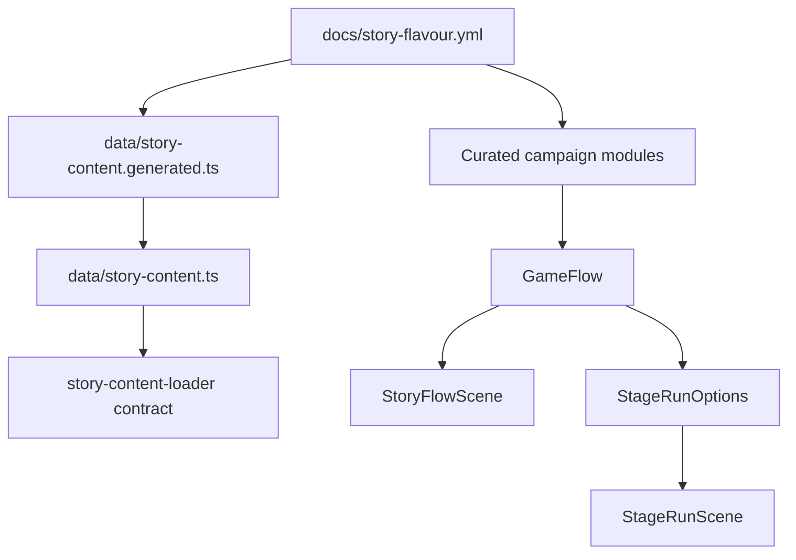

# Story Flavour Integration

`docs/story-flavour.yml` is the broad story bible for Badger Sprawl Runner. It contains tone, universe notes, chapter concepts, characters, areas, side quests, minigames, bosses, visual prompts, idle actions, and reusable barks. The runtime does not parse this YAML directly during play; instead, the repository keeps a generated TypeScript story-content artifact and a curated campaign runtime registry.

## Current integration model

```yaml
source_of_truth_layers:
  design_bible:
    file: docs/story-flavour.yml
    purpose:
      - high-level tone and world vocabulary
      - all eight chapter concepts
      - character voices and sample lines
      - area, side quest, minigame, boss, and asset prompt source material
  generated_content_pack:
    file: data/story-content.generated.ts
    loaded_by: data/story-content.ts
    verified_by: tests/story-content-loader.mjs
    purpose:
      - generated chapter summaries
      - global idle actions
      - reusable barks
      - lightweight non-runtime story content lookup
  runtime_campaign_registry:
    barrel: apps/runner/src/game/Campaign.ts
    modules:
      - apps/runner/src/game/campaign/schema.ts
      - apps/runner/src/game/campaign/campaignData.ts
      - apps/runner/src/game/campaign/sideQuests.ts
      - apps/runner/src/game/campaign/minigames.ts
      - apps/runner/src/game/campaign/branchConsequences.ts
    purpose:
      - typed campaign stages
      - branch choices and result flags
      - boss contracts
      - side quest and minigame contracts
      - runtime-safe debrief/briefing text
      - StageRunScene option projection
```

## Flow diagram



## Why YAML is not loaded directly in-game

```yaml
runtime_reasons:
  determinism:
    - browser runtime should not depend on YAML parser behavior
    - tests should read typed campaign objects with stable field names
  bundle_size:
    - generated TypeScript is smaller and easier for the bundler to tree-shake
  curation:
    - story-flavour.yml is intentionally broad and expansive
    - runtime text must be trimmed to readable panels and stable result flags
  safety:
    - save migration and branch consequences depend on stable ids
    - direct YAML churn should not accidentally break save compatibility
```

## Mapping table

```yaml
story_flavour_to_runtime:
  schema_version:
    target: data/story-content.generated.ts metadata and docs contracts
  creative_direction:
    target:
      - docs/story-content-system.md
      - docs/dialogue-system.md
      - docs/sprite-generation-prompts.md
  universe:
    target:
      - Campaign placards
      - StoryFlowScene title cards
      - reusable barks/generated story content
  gear_and_systems:
    target:
      - data/items.json
      - skill tree and ability TODOs
      - sprite prompts
  chapters:
    target:
      - CAMPAIGN.stages
      - stage layout ids
      - boss contracts
      - side quest registry
      - minigame registry
      - branch consequence registry
  global_idle_actions:
    target:
      - data/story-content.generated.ts
      - future idle action system
  reusable_barks:
    target:
      - data/story-content.generated.ts
      - future bark/voice system
  visual_prompt_fields:
    target:
      - docs/sprite-generation-prompts.md
      - future per-stage sprite prompt manifests
```

## Runtime consumers

```yaml
GameFlow:
  consumes:
    - CAMPAIGN.stages
    - branch choices
    - debrief specs
    - result flags
  produces:
    - story state machine
    - StoryProgress mutations
    - branch-specific debrief lines

StoryFlowScene:
  consumes:
    - GameFlow title-card/dialogue/stage/debrief modes
    - ChoiceOutcome data
    - BranchChoiceRecap data
  produces:
    - visible dialogue panels
    - visible choice panel
    - badger:story-choice-recap
    - stage debug detail

StageRunOptions:
  consumes:
    - GameFlow current stage
    - StoryProgress
    - MetaState
    - BRANCH_CONSEQUENCES
  produces:
    - StageRunSceneOptions
    - branch gameplay hooks
    - boss placeholder
    - tutorial overlay beats
    - story balance rules

StoryContentLoader:
  consumes:
    - GENERATED_STORY_CONTENT
  produces:
    - generated story content cache
  current_scope:
    - chapter summaries
    - global idle actions
    - reusable barks
```

## Verification gates

```yaml
contracts:
  story_content_loader:
    command: node tests/story-content-loader.mjs
    proves:
      - data/story-content.ts imports GENERATED_STORY_CONTENT
      - generated content includes eight chapters
      - generated content includes globalIdleActions and reusableBarks
  runtime_contracts:
    command: node tests/runtime-contracts.mjs
    proves:
      - campaign modules are split and exported through Campaign.ts
      - dialogue docs cover current runtime concepts
      - story-flavour integration docs cover generated and curated paths
  story_e2e:
    command: pnpm exec playwright test tests/e2e/story-content.spec.ts --project=chromium
    proves:
      - browser app loads story content surface
      - core characters from the story bible remain discoverable
```

## Updating story-flavour content safely

```yaml
checklist:
  - edit docs/story-flavour.yml for broad design/story additions
  - regenerate or update data/story-content.generated.ts when chapter summaries, idle actions, or reusable barks change
  - curate runtime-critical pieces into campaign modules instead of reading raw YAML in-game
  - keep ids stable once they touch saves, resultFlags, branch consequences, or e2e tests
  - add/update tests for any runtime-facing mapping
  - update docs/dialogue-system.md when dialogue state behavior changes
  - update docs/story-content-system.md when runtime bridge responsibilities change
```

## Current limitations

```yaml
limitations:
  - no direct YAML parser runs in the browser runtime
  - generated content is a static TypeScript artifact
  - side quest and minigame YAML concepts are present as contracts, not full runtime scenes
  - idle actions and reusable barks are loaded into generated content but not yet a full bark scheduler
  - production art/audio prompt manifests are still separate TODO work
```
